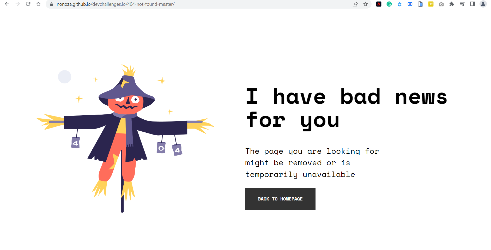
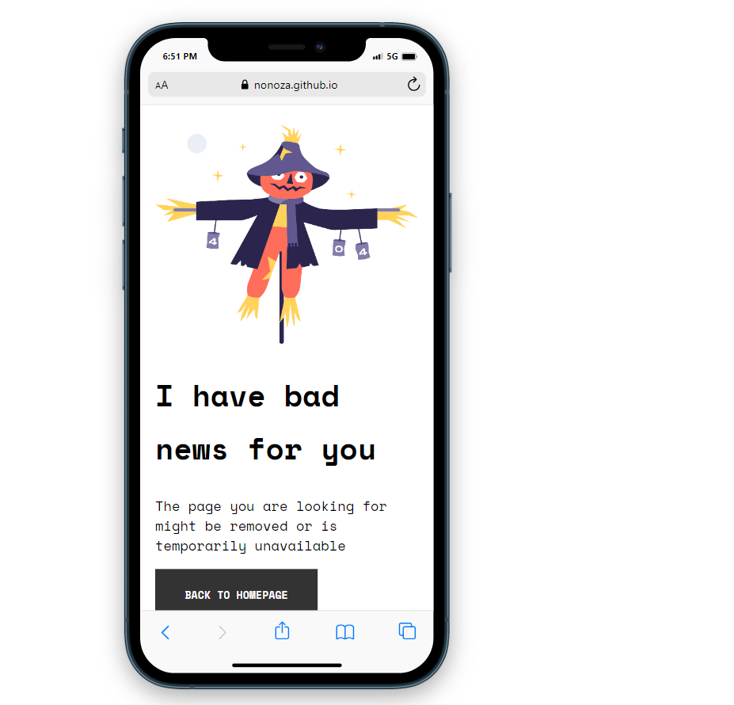

<!-- Please update value in the {}  -->

<h1 align="center">{404 Not Found}</h1>

   Solution for a challenge from  <a href="http://devchallenges.io" target="_blank">Devchallenges.io</a>.

  <h3>
    <a href="https://{[nonoza.github.io/devchallenges.io/404-not-found-master/]}">
      Demo
    </a>
     | 
    <a href="https://{[nonoza/devchallenges.io/tree/main/404-not-found-master)}">
      Solution
    </a>
     | 
    <a href="https://devchallenges.io/challenges/wBunSb7FPrIepJZAg0sY">
      Challenge
    </a>
  </h3>

<!-- TABLE OF CONTENTS -->

## Table of Contents

- [Overview](#overview)
  - [Built With](#built-with)
- [Features](#features)
- [Contact](#contact)
- [Acknowledgements](#acknowledgements)

<!-- OVERVIEW -->

## Overview

Introduce your projects by taking a screenshot or a gif. Try to tell visitors a story about your project by answering:

- Where can I see your demo?
     - You can view my demo on GitHub. You can click the Demo  as well as the Solution link.
- What was your experience?
   - Working with "rem" on styling text. I still need to learn about that.
- What have you learned/improved?
  - Mobile responsive is very important

### Built With

<!-- This section should list any major frameworks that you built your project using. Here are a few examples.-->

- [HTML]
- [CSS]

## Contact

- Website [your-website.com](https://{prettynkunene.co.za})
- GitHub [@your-username](https://{github.com/nonoza})

